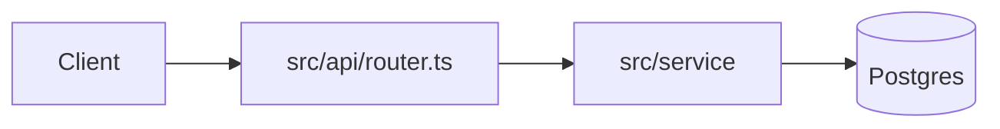

# Handover Log and Obsidian Context Vault Implementation Plan

> **For agentic workers:** REQUIRED SUB-SKILL: Use superpowers:subagent-driven-development (recommended) or superpowers:executing-plans to implement this plan task-by-task. Steps use checkbox (`- [ ]`) syntax for tracking.

**Goal:** Add two opt-in skills to this fork — `handover` (a git-ignored per-agent change log) and `obsidian` (a git-ignored Obsidian vault with an architecture note and one note per file) — and wire them into the existing workflow skills.

**Architecture:** Each skill is a SKILL.md plus small bash+git helpers in `scripts/`. The helpers resolve the main checkout root (so linked worktrees share one log and one vault) and derive every file list from git; the agent writes the prose. Workflow skills gain short, conditional hand-offs; the session-start hook gains a one-line reminder per opted-in artifact.

**Tech Stack:** bash (Git Bash on Windows, any POSIX bash elsewhere), git ≥ 2.31 (`--path-format`), awk, grep. Tests are bash; the hook test uses node (already required by `tests/hooks/test-session-start.sh`).

**Spec:** `docs/superpowers/specs/2026-10-01-handover-obsidian-design.md`

## Global Constraints

- Zero dependencies: scripts use only bash, git, awk, grep, sed, tr, head, tail, dirname, mkdir.
- Script style (match `skills/executing-plans/scripts/task-done`): extensionless, `#!/usr/bin/env bash`, `set -euo pipefail`, a header comment with a `# Usage:` line, exit 2 on bad arguments.
- New scripts are committed with mode 100755 (`git update-index --chmod=+x <file>` after `git add`; Windows checkouts do not record the bit on their own).
- New files use LF line endings.
- Scripts are invoked as `bash <path>/scripts/<name>` — in docs, tests and from other scripts.
- Skill voice: "your human partner", never "the user". Frontmatter has exactly `name` and `description`; descriptions start with "Use when" and list triggers only.
- The artifacts' names are fixed: `handover.md` and `.obsidian-vault/` at the main checkout root; vault notes at `.obsidian-vault/files/<repo path>.md`; sync state in `.obsidian-vault/.sync-state`; extra exclusions in `.obsidian-vault/.vaultignore`.
- Commits: one per task; messages written to a file and committed with `git commit -F <file>`; every message ends with:
  ```
  Co-Authored-By: Claude Opus 5.5 <noreply@anthropic.com>
  Claude-Session: https://claude.ai/code/session_0159cxcbQ8TE2cBNxSYuxDU4
  ```
- Stage by explicit path, never `git add -A` in this repo.

## Review Focus

- Running a helper from a subdirectory of the checkout must behave exactly as from the root — repo-relative paths, same root. Pinned in Task 1 (`handover-path`/`handover-files` from `sub/dir`).
- Paths with spaces and non-ASCII characters must come out verbatim (no git octal quoting). Pinned in Task 1 (`dir with space/ção.txt`).
- `--init` on a `.gitignore` without a trailing newline must not glue the new pattern onto the last line. Pinned in Task 1 (and the same code in Task 3).
- A `.vaultignore` saved by a Windows editor (CRLF, comments, blank lines) must still match. Pinned in Task 3.
- A repository with no commits yet must get a clear error, not a stack of git noise. Pinned in Task 1 (`handover-files` exits 2).

---

### Task 1: handover helper scripts

**Files:**
- Create: `skills/handover/scripts/handover-path`
- Create: `skills/handover/scripts/handover-files`
- Create: `tests/claude-code/test-handover-scripts.sh`
- Modify: `tests/claude-code/run-skill-tests.sh` (the `tests=(…)` list)
- Modify: `.gitattributes`

**Interfaces:**
- Consumes: nothing.
- Produces:
  - `bash skills/handover/scripts/handover-path [--init]` → stdout: absolute path of `<main root>/handover.md`; exit 0 when it exists, 1 (stdout empty) when not opted in, 2 on bad args. `--init` creates the log with the header below and appends `/handover.md` to `<main root>/.gitignore` unless already ignored or already listed.
  - `bash skills/handover/scripts/handover-files [BASE [HEAD]]` → stdout: `**Branch:** <branch> @ <base7>..<head7>[ + uncommitted]`, a blank line, then one line per changed file: `` - `path` (M) — `` or `` - `old` → `new` (R) — ``. Empty stdout + exit 0 when nothing changed. Exit 2 on bad args / bad BASE / not a git repo.
  - Log header (exact):
    ```
    # Handover log

    Every agent that changes code in this project appends one entry at the
    end (oldest first). Read the latest entries before changing code.
    ```
  - Entry range line format consumed by the default-BASE logic: `**Branch:** <anything> @ <7-40 hex>..<7-40 hex>[anything]`.

- [ ] **Step 1: Write the failing test**

Create `tests/claude-code/test-handover-scripts.sh`:

```bash
#!/usr/bin/env bash
# Tests for the handover skill's helpers: scripts/handover-path resolves (and
# initializes) the git-ignored log at the main checkout root — from a
# subdirectory or a linked worktree too — and scripts/handover-files prints
# the git-derived part of an entry, chaining from the latest entry.
set -euo pipefail

SCRIPT_DIR="$(cd "$(dirname "$0")" && pwd)"
REPO_ROOT="$(cd "$SCRIPT_DIR/../.." && pwd)"
HO_SCRIPTS="$REPO_ROOT/skills/handover/scripts"

FAILURES=0
TEST_ROOT=""
REPO=""
GIT_ID=(-c user.email=t@example.com -c user.name=t -c commit.gpgsign=false)

pass() { echo "  [PASS] $1"; }
fail() {
    echo "  [FAIL] $1"
    FAILURES=$((FAILURES + 1))
}
expect_eq() {
    if [[ "$2" == "$3" ]]; then pass "$1"; else
        fail "$1"; echo "    expected: $3"; echo "    got:      $2"
    fi
}
expect_contains() {
    if [[ "$2" == *"$3"* ]]; then pass "$1"; else
        fail "$1"; echo "    expected to contain: $3"; printf '%s\n' "$2" | sed 's/^/    | /'
    fi
}
expect_not_contains() {
    if [[ "$2" != *"$3"* ]]; then pass "$1"; else
        fail "$1"; echo "    expected NOT to contain: $3"; printf '%s\n' "$2" | sed 's/^/    | /'
    fi
}
in_repo() { ( cd "$REPO" && "$@" ); }
commit_all() { ( cd "$REPO" && git add -A && git "${GIT_ID[@]}" commit -qm "$1" ); }

cleanup() {
    if [[ -n "$TEST_ROOT" && -d "$TEST_ROOT" ]]; then
        rm -rf "$TEST_ROOT"
    fi
}

main() {
    echo "=== Test: handover scripts ==="

    TEST_ROOT="$(mktemp -d)"
    trap cleanup EXIT

    local rc out err base head mid

    # --- a repository without commits: clear error ---
    git init -q -b main "$TEST_ROOT/empty"
    rc=0
    err="$( (cd "$TEST_ROOT/empty" && bash "$HO_SCRIPTS/handover-files") 2>&1 >/dev/null)" || rc=$?
    expect_eq "handover-files in a repo without commits exits 2" "$rc" "2"
    expect_contains "…and says why" "$err" "bad BASE"

    git init -q -b main "$TEST_ROOT/repo"
    REPO="$(cd "$TEST_ROOT/repo" && git rev-parse --show-toplevel)"

    # --- argument validation ---
    rc=0; in_repo bash "$HO_SCRIPTS/handover-path" --bogus >/dev/null 2>&1 || rc=$?
    expect_eq "handover-path rejects an unknown flag with exit 2" "$rc" "2"
    rc=0; in_repo bash "$HO_SCRIPTS/handover-files" a b c >/dev/null 2>&1 || rc=$?
    expect_eq "handover-files rejects three arguments with exit 2" "$rc" "2"

    printf 'one\n' > "$REPO/a.txt"
    printf 'gone\n' > "$REPO/c.txt"
    printf 'move me\n' > "$REPO/d.txt"
    printf 'node_modules/' > "$REPO/.gitignore"   # no trailing newline, on purpose
    commit_all fixture
    base="$(in_repo git rev-parse HEAD)"

    rc=0; in_repo bash "$HO_SCRIPTS/handover-files" not-a-commit >/dev/null 2>&1 || rc=$?
    expect_eq "handover-files rejects an unknown BASE with exit 2" "$rc" "2"

    # --- not opted in ---
    rc=0; out="$(in_repo bash "$HO_SCRIPTS/handover-path" 2>/dev/null)" || rc=$?
    expect_eq "handover-path exits 1 when the project has not opted in" "$rc" "1"
    expect_eq "handover-path prints nothing on stdout when not opted in" "$out" ""

    # --- init ---
    out="$(in_repo bash "$HO_SCRIPTS/handover-path" --init 2>/dev/null)"
    expect_eq "handover-path --init prints the log path at the main root" "$out" "$REPO/handover.md"
    expect_eq "the new log starts with its header" "$(head -n 1 "$REPO/handover.md")" "# Handover log"
    expect_eq ".gitignore keeps its last pattern intact" "$(grep -c '^node_modules/$' "$REPO/.gitignore")" "1"
    in_repo bash "$HO_SCRIPTS/handover-path" --init >/dev/null 2>&1
    expect_eq "a second --init does not duplicate the ignore line" "$(grep -c '^/handover.md$' "$REPO/.gitignore")" "1"
    if in_repo git check-ignore -q handover.md; then pass "handover.md is git-ignored"; else fail "handover.md is git-ignored"; fi
    commit_all "ignore handover log"

    # --- from a subdirectory and from a linked worktree ---
    mkdir -p "$REPO/sub/dir"
    out="$(cd "$REPO/sub/dir" && bash "$HO_SCRIPTS/handover-path")"
    expect_eq "handover-path from a subdirectory resolves the root log" "$out" "$REPO/handover.md"
    in_repo git worktree add -q ../wt -b wt
    out="$(cd "$TEST_ROOT/wt" && bash "$HO_SCRIPTS/handover-path")"
    expect_eq "handover-path in a linked worktree resolves the main checkout's log" "$out" "$REPO/handover.md"
    if [[ -e "$TEST_ROOT/wt/handover.md" ]]; then fail "no handover.md appears inside the worktree"; else pass "no handover.md appears inside the worktree"; fi

    # --- an explicit committed range: M, A, D, R, odd paths ---
    printf 'one\ntwo\n' > "$REPO/a.txt"
    printf 'new\n' > "$REPO/b.txt"
    rm "$REPO/c.txt"
    in_repo git mv d.txt e.txt
    mkdir -p "$REPO/dir with space"
    printf 'acentos\n' > "$REPO/dir with space/ção.txt"
    commit_all change
    head="$(in_repo git rev-parse HEAD)"
    out="$(in_repo bash "$HO_SCRIPTS/handover-files" "$base" "$head")"
    expect_contains "the output starts with the Branch line" "$out" "**Branch:** main @ ${base:0:7}..${head:0:7}"
    expect_not_contains "a committed range is not marked uncommitted" "$out" "+ uncommitted"
    expect_contains "a modified file is listed as M" "$out" '- `a.txt` (M) — '
    expect_contains "an added file is listed as A" "$out" '- `b.txt` (A) — '
    expect_contains "a deleted file is listed as D" "$out" '- `c.txt` (D) — '
    expect_contains "a rename is listed as R with both paths" "$out" '- `d.txt` → `e.txt` (R) — '
    expect_contains "paths with spaces and accents come out verbatim" "$out" '- `dir with space/ção.txt` (A) — '
    expect_not_contains "the log itself is never listed" "$out" 'handover.md'

    # --- working tree changes, run from a subdirectory ---
    printf 'three\n' >> "$REPO/a.txt"
    printf 'u\n' > "$REPO/sub/u.txt"
    mkdir -p "$REPO/.obsidian-vault"
    printf 'note\n' > "$REPO/.obsidian-vault/n.md"   # not ignored here: the filter must drop it
    out="$(cd "$REPO/sub/dir" && bash "$HO_SCRIPTS/handover-files" "$head")"
    expect_contains "an uncommitted range is marked" "$out" "..${head:0:7} + uncommitted"
    expect_contains "an uncommitted modification is listed" "$out" '- `a.txt` (M) — '
    expect_contains "an untracked file is listed with its repo-relative path" "$out" '- `sub/u.txt` (A) — '
    expect_not_contains "vault files are never listed" "$out" '.obsidian-vault'
    rm -rf "$REPO/.obsidian-vault"
    commit_all more

    # --- default BASE chains from the latest entry ---
    mid="$(in_repo git rev-parse HEAD)"
    printf '\n## 2026-10-01 10:00 · main session · test-model\n**Branch:** main @ %s..%s\n**Summary:** fixture entry.\n\n- `a.txt` (M) — fixture\n' \
        "${base:0:7}" "${mid:0:7}" >> "$REPO/handover.md"
    printf 'f\n' > "$REPO/f.txt"
    commit_all "after entry"
    out="$(in_repo bash "$HO_SCRIPTS/handover-files")"
    expect_contains "the default BASE is the latest entry's end commit" "$out" "@ ${mid:0:7}.."
    expect_contains "a change after the latest entry is listed" "$out" '- `f.txt` (A) — '
    expect_not_contains "changes before the latest entry are not repeated" "$out" '`b.txt`'

    # --- latest entry not in HEAD's history: uncommitted changes only ---
    in_repo git switch -q -c side "$base"
    printf 's\n' > "$REPO/s.txt"
    err="$(in_repo bash "$HO_SCRIPTS/handover-files" 2>&1 >/dev/null)"
    expect_contains "a latest entry outside HEAD's history triggers a warning" "$err" "not in HEAD's history"
    out="$(in_repo bash "$HO_SCRIPTS/handover-files" 2>/dev/null)"
    expect_contains "the fallback lists the uncommitted change" "$out" '- `s.txt` (A) — '
    expect_not_contains "the fallback lists nothing committed" "$out" '`f.txt`'
    expect_not_contains "an un-ignored handover.md is still never listed" "$out" 'handover.md'

    # --- nothing changed ---
    rm "$REPO/s.txt"
    rc=0; out="$(in_repo bash "$HO_SCRIPTS/handover-files" HEAD 2>/dev/null)" || rc=$?
    expect_eq "no changes: exit 0" "$rc" "0"
    expect_eq "no changes: nothing on stdout" "$out" ""

    if [[ "$FAILURES" -gt 0 ]]; then
        echo "STATUS: FAILED ($FAILURES failure(s))"
        exit 1
    fi
    echo "STATUS: PASSED"
}

main "$@"
```

- [ ] **Step 2: Run the test to verify it fails**

Run: `bash tests/claude-code/test-handover-scripts.sh`
Expected: FAIL — `bash: …/skills/handover/scripts/handover-files: No such file or directory` on the first assertion (exit non-zero; the first `[FAIL]` lines appear).

- [ ] **Step 3: Write `skills/handover/scripts/handover-path`**

```bash
#!/usr/bin/env bash
# Resolve this project's handover log: handover.md at the root of the main
# checkout. A linked worktree resolves to the main checkout too — the log is
# git-ignored, so a copy inside a worktree would be missing or lost.
#
# Usage: handover-path [--init]
#   Prints the log's absolute path and exits 0 when the log exists.
#   Exits 1 with nothing on stdout when this project has not opted in.
#   --init  create the log (with its header) if missing and git-ignore it.
set -euo pipefail

usage() { echo "usage: handover-path [--init]" >&2; exit 2; }
[ $# -le 1 ] || usage
init=0
case "${1:-}" in
  "") ;;
  --init) init=1 ;;
  *) usage ;;
esac

in_git=0
if common=$(git rev-parse --path-format=absolute --git-common-dir 2>/dev/null); then
  in_git=1
  case "$common" in
    */.git) root=$(dirname "$common") ;;
    *) root=$(git rev-parse --show-toplevel) ;;
  esac
else
  root=$(pwd)
fi
log="$root/handover.md"

if [ "$init" -eq 1 ]; then
  if [ ! -f "$log" ]; then
    printf '%s\n' "# Handover log" "" \
      "Every agent that changes code in this project appends one entry at the" \
      "end (oldest first). Read the latest entries before changing code." > "$log"
  fi
  gi="$root/.gitignore"
  if [ "$in_git" -eq 1 ] && ! git -C "$root" check-ignore -q handover.md \
    && ! grep -qxF '/handover.md' "$gi" 2>/dev/null; then
    if [ -s "$gi" ] && [ -n "$(tail -c 1 "$gi")" ]; then printf '\n' >> "$gi"; fi
    printf '/handover.md\n' >> "$gi"
    echo "handover-path: added /handover.md to .gitignore (uncommitted)" >&2
  fi
fi

if [ -f "$log" ]; then
  printf '%s\n' "$log"
else
  echo "handover-path: no handover.md at $root — this project has not opted in" >&2
  exit 1
fi
```

- [ ] **Step 4: Write `skills/handover/scripts/handover-files`**

```bash
#!/usr/bin/env bash
# Print the git-derived part of a handover entry: the **Branch:** line and
# one skeleton line per changed file, so no changed file depends on the
# agent's memory. The agent fills in each line's description.
#
# Usage: handover-files [BASE [HEAD]]
#   BASE defaults to the end commit of the latest entry in handover.md when
#   that commit is in HEAD's history, otherwise to HEAD. Without HEAD, the
#   working tree counts too: uncommitted and untracked files are listed and
#   the range is marked "+ uncommitted".
# Output: "**Branch:** <branch> @ <base7>..<head7>", a blank line, then
#   "- `path` (M) — " per file; renames as "- `old` → `new` (R) — ".
#   Nothing on stdout (a note on stderr) when nothing changed.
set -euo pipefail

usage() { echo "usage: handover-files [BASE [HEAD]]" >&2; exit 2; }
[ $# -le 2 ] || usage
top=$(git rev-parse --show-toplevel 2>/dev/null) || { echo "handover-files: not a git repository" >&2; exit 2; }
here=$(cd "$(dirname "$0")" && pwd)
cd "$top"
base=${1:-}
head=${2:-}

if [ -z "$base" ]; then
  last=""
  if log=$(bash "$here/handover-path" 2>/dev/null); then
    last=$(sed -n 's/^\*\*Branch:\*\* .* @ [0-9a-f]\{7,40\}\.\.\([0-9a-f]\{7,40\}\).*$/\1/p' "$log" | tail -n 1)
  fi
  if [ -n "$last" ] && git merge-base --is-ancestor "$last" HEAD 2>/dev/null; then
    base=$last
  else
    if [ -n "$last" ]; then
      echo "handover-files: latest entry ends at $last, which is not in HEAD's history; listing uncommitted changes only" >&2
    fi
    base=HEAD
  fi
fi
git rev-parse --verify --quiet "$base^{commit}" >/dev/null || { echo "handover-files: bad BASE: $base" >&2; exit 2; }
if [ -n "$head" ]; then
  git rev-parse --verify --quiet "$head^{commit}" >/dev/null || { echo "handover-files: bad HEAD: $head" >&2; exit 2; }
fi

if [ -n "$head" ]; then
  changes=$(git -c core.quotePath=false diff --name-status -M "$base" "$head")
  untracked=""
else
  changes=$(git -c core.quotePath=false diff --name-status -M "$base")
  untracked=$(git -c core.quotePath=false ls-files --others --exclude-standard)
fi

lines=$(
  {
    printf '%s\n' "$changes"
    if [ -n "$untracked" ]; then printf '%s\n' "$untracked" | awk '{ print "A\t" $0 }'; fi
  } | awk -F'\t' '
    NF < 2 { next }
    { s = substr($1, 1, 1); p = (s == "R" || s == "C") ? $3 : $2 }
    p == "handover.md" || p ~ /^\.obsidian-vault\// { next }
    s == "R" || s == "C" { printf "- `%s` → `%s` (%s) — \n", $2, $3, s; next }
    { printf "- `%s` (%s) — \n", $2, s }'
)

if [ -z "$lines" ]; then
  echo "handover-files: no changes since $(git rev-parse --short=7 "$base")" >&2
  exit 0
fi

branch=$(git rev-parse --abbrev-ref HEAD)
[ "$branch" != "HEAD" ] || branch=detached
range="$(git rev-parse --short=7 "$base")..$(git rev-parse --short=7 "${head:-HEAD}")"
if [ -z "$head" ] && { [ -n "$untracked" ] || ! git diff --quiet HEAD --; }; then
  range="$range + uncommitted"
fi
printf '**Branch:** %s @ %s\n\n%s\n' "$branch" "$range" "$lines"
```

- [ ] **Step 5: Run the test to verify it passes**

Run: `bash tests/claude-code/test-handover-scripts.sh`
Expected: every line `[PASS]`, last line `STATUS: PASSED`, exit 0.

- [ ] **Step 6: Register the test, pin script line endings**

In `tests/claude-code/run-skill-tests.sh`, the `tests=(` list becomes:

```bash
tests=(
    "test-worktree-path-policy.sh"
    "test-sdd-workspace.sh"
    "test-executing-plans-scripts.sh"
    "test-handover-scripts.sh"
    "test-subagent-driven-development.sh"
)
```

In `.gitattributes`, after the `hooks/session-start text eol=lf` line, add:

```
skills/*/scripts/* text eol=lf
```

Run: `git check-attr eol -- skills/handover/scripts/handover-files`
Expected: `skills/handover/scripts/handover-files: eol: lf`

- [ ] **Step 7: Commit**

```bash
git add skills/handover/scripts/handover-path skills/handover/scripts/handover-files \
  tests/claude-code/test-handover-scripts.sh tests/claude-code/run-skill-tests.sh .gitattributes
git update-index --chmod=+x skills/handover/scripts/handover-path skills/handover/scripts/handover-files \
  tests/claude-code/test-handover-scripts.sh
# write the message to a file, then:
git commit -F <message-file>   # "feat(handover): log path and changed-file helpers" + attribution lines
git ls-files -s skills/handover/scripts | cat    # both lines start with 100755
git log -1 --format=%B                            # message stored as written
```

---

### Task 2: handover skill

**Files:**
- Create: `skills/handover/SKILL.md`
- Create: `tests/context-skills/test-skill-structure.sh` (checks both skills; the obsidian half fails until Task 4 — run it with `handover` only here)
- Modify: `docs/testing.md` (Plugin tests list)

**Interfaces:**
- Consumes: Task 1's `handover-path [--init]` and `handover-files [BASE [HEAD]]` exactly as specified there.
- Produces: skill `handover` (name), with sections `## Red Flags`; the entry format the SDD Context Upkeep block (Task 6) repeats: header `## <YYYY-MM-DD HH:MM> · <agent name> · <model id>`, then the script's `**Branch:**` line, `**Summary:**`, optional `**Open:**`, blank line, file lines. The structure test takes skill names as arguments: `bash tests/context-skills/test-skill-structure.sh [handover] [obsidian]` (no arguments = both).

- [ ] **Step 1: Write the failing structure test**

Create `tests/context-skills/test-skill-structure.sh`:

```bash
#!/usr/bin/env bash
# Structural checks for the fork's context skills (skills/handover and
# skills/obsidian): frontmatter, word budget, required sections, expected and
# referenced files exist, helper scripts are executable in git, no
# machine-specific paths, "your human partner" voice. Behavior is checked by
# the scenario runs recorded in the implementation plan, not here.
#
# Usage: test-skill-structure.sh [SKILL...]   (default: handover obsidian)
set -u

SCRIPT_DIR="$(cd "$(dirname "$0")" && pwd)"
REPO_ROOT="$(cd "$SCRIPT_DIR/../.." && pwd)"
WORD_BUDGET=1000

PASSES=0
FAILURES=0

pass() { echo "  [PASS] $1"; PASSES=$((PASSES + 1)); }
fail() { echo "  [FAIL] $1"; FAILURES=$((FAILURES + 1)); }

expected_files() {
  case "$1" in
    handover) echo "SKILL.md scripts/handover-path scripts/handover-files" ;;
    obsidian) echo "SKILL.md note-templates.md scripts/vault-path scripts/vault-changes scripts/vault-mark-synced" ;;
  esac
}

check_skill() {
  local name="$1"
  local skill_dir="$REPO_ROOT/skills/$name"
  local skill_md="$skill_dir/SKILL.md"
  echo "$name structure"

  local rel
  for rel in $(expected_files "$name"); do
    if [ -f "$skill_dir/$rel" ]; then pass "$name: expected file present: $rel"; else fail "$name: expected file present: $rel"; fi
  done
  [ -f "$skill_md" ] || return

  # --- frontmatter ----------------------------------------------------------
  local frontmatter description
  frontmatter="$(awk 'NR==1 && $0!="---"{exit} NR>1 && $0=="---"{exit} NR>1{print}' "$skill_md")"
  if printf '%s\n' "$frontmatter" | grep -q "^name: $name\$"; then
    pass "$name: frontmatter name matches the directory"
  else
    fail "$name: frontmatter name matches the directory"
  fi
  if [ "$(printf '%s\n' "$frontmatter" | grep -c '^[A-Za-z_-]*:')" -eq 2 ]; then
    pass "$name: frontmatter has only name and description"
  else
    fail "$name: frontmatter has only name and description"
  fi
  description="$(printf '%s\n' "$frontmatter" | awk '/^description:/{sub(/^description:[ ]*/,""); print; found=1; next} found && /^[ ]/{print} found && !/^[ ]/{exit}' | tr '\n' ' ')"
  if printf '%s' "$description" | grep -q '^Use when'; then
    pass "$name: description starts with 'Use when'"
  else
    fail "$name: description starts with 'Use when' (got: ${description:0:60})"
  fi
  if [ "${#description}" -le 1024 ]; then
    pass "$name: description under 1024 characters"
  else
    fail "$name: description under 1024 characters (${#description})"
  fi
  local banned
  for banned in dispatch then step; do
    if printf '%s' "$description" | grep -qiw "$banned"; then
      fail "$name: description contains workflow word '$banned'"
    else
      pass "$name: description avoids workflow word '$banned'"
    fi
  done

  # --- body -----------------------------------------------------------------
  local body_words
  body_words="$(awk 'BEGIN{fm=0} NR==1 && $0=="---"{fm=1; next} fm==1 && $0=="---"{fm=2; next} fm==2{print}' "$skill_md" | wc -w | tr -d ' ')"
  if [ "$body_words" -le "$WORD_BUDGET" ]; then
    pass "$name: SKILL.md body within $WORD_BUDGET words ($body_words)"
  else
    fail "$name: SKILL.md body within $WORD_BUDGET words ($body_words)"
  fi
  if grep -q '^## Red Flags' "$skill_md"; then pass "$name: has '## Red Flags'"; else fail "$name: has '## Red Flags'"; fi

  # --- every scripts/<x> the skill mentions exists and is executable in git -
  local ref mode
  while IFS= read -r ref; do
    [ -n "$ref" ] || continue
    if [ -f "$skill_dir/$ref" ]; then pass "$name: referenced file exists: $ref"; else fail "$name: referenced file exists: $ref"; fi
  done < <(grep -o 'scripts/[a-z][a-z-]*' "$skill_md" | sort -u)
  while IFS= read -r ref; do
    [ -n "$ref" ] || continue
    mode="$(git -C "$REPO_ROOT" ls-files -s -- "skills/$name/$ref" | cut -c1-6)"
    if [ "$mode" = "100755" ]; then pass "$name: $ref is executable in git"; else fail "$name: $ref is executable in git (mode '${mode:-untracked}')"; fi
  done < <(cd "$skill_dir" && ls -1 scripts 2>/dev/null | sed 's#^#scripts/#')

  # --- leaks and voice --------------------------------------------------------
  local leaks user_hits
  leaks="$(grep -rn -E '/Users/|/home/|[A-Za-z]:[/\\]Users|nilso' "$skill_dir" 2>/dev/null || true)"
  if [ -z "$leaks" ]; then pass "$name: no machine-specific paths or names"; else
    fail "$name: no machine-specific paths or names"; printf '%s\n' "$leaks" | head -5 | sed 's/^/    /'
  fi
  user_hits="$(grep -rn -i 'the user' "$skill_dir" 2>/dev/null || true)"
  if [ -z "$user_hits" ]; then pass "$name: says 'your human partner', not 'the user'"; else
    fail "$name: says 'your human partner', not 'the user'"; printf '%s\n' "$user_hits" | head -5 | sed 's/^/    /'
  fi
}

skills=("$@")
[ ${#skills[@]} -gt 0 ] || skills=(handover obsidian)
for s in "${skills[@]}"; do check_skill "$s"; done

echo
echo "Passed: $PASSES  Failed: $FAILURES"
[ "$FAILURES" -eq 0 ]
```

- [ ] **Step 2: Run it to verify it fails**

Run: `bash tests/context-skills/test-skill-structure.sh handover`
Expected: FAIL — `[FAIL] handover: expected file present: SKILL.md`, final line `Passed: 2  Failed: 1`, exit 1.

- [ ] **Step 3: Write `skills/handover/SKILL.md`**

````markdown
---
name: handover
description: Use when a project has a handover.md log (or your human partner asks to start one) and you are about to change code there or have just finished a change
---

# Handover

## Overview

A handover log lets the next agent — or person — pick up where the last one
stopped: who changed what, why, and what is still open. It is `handover.md`
at the root of the main checkout, git-ignored, and every agent that changes
code appends one entry.

**Core principle:** the file list comes from git; the explanation comes from
you. An entry that relies on memory for which files changed is already
incomplete.

Run this skill's scripts from anywhere inside the project, as
`bash <this skill's directory>/scripts/<name>`.

## Is this project opted in?

`bash scripts/handover-path` prints the log's path and exits 0 when the
project keeps a log. Exit 1 means it does not: do nothing, and do not start
one unless your human partner asks. To start one when asked:
`bash scripts/handover-path --init` — it creates the log and git-ignores it;
tell your human partner `.gitignore` changed.

Inside a linked worktree the script still answers with the main checkout's
log. Never write a `handover.md` inside a worktree.

## Before changing code

Read the latest entries (the end of the file): what the previous agent
changed, what it left open, where it stopped. When an entry and the code
disagree, the code wins — say so in your own entry.

## After a change

Write one entry per coherent unit of change — a plan task, a fix round, or a
change your human partner would recognize as one piece of work — before you
claim it done.

1. `bash scripts/handover-files [BASE]` prints the entry's `**Branch:**` line
   and one skeleton line per changed file. BASE defaults to where the latest
   entry ended; pass the commit you started from when you know it (in a plan
   task: the task's BASE).
2. Fill every skeleton line with what changed in that file and why, and add
   the header and summary:

   ```markdown
   ## 2026-10-01 15:40 · implementer (Task 3) · claude-sonnet-5-5
   **Branch:** feature-x @ a1b2c3d..d4e5f6a
   **Summary:** What changed and why, in one to three sentences.
   **Open:** Anything unfinished or risky the next agent must know (omit when empty).

   - `src/router.ts` (M) — retries outbound calls with backoff
   - `src/retry.ts` (A) — new helper: exponential backoff, max 3 tries
   ```
3. Append the whole entry to the end of the log in one write, never line by
   line — parallel agents may be appending too.

**Agent name:** the name your harness gives you (a named agent or teammate);
otherwise your role — `main session`, `implementer (Task N)`, `fix round 2
(Task N)`, `parallel agent: <scope>` — always followed by your model id.
**Language:** the one your human partner uses.

If the project also keeps an Obsidian vault, update it now with the same file
list (superpowers:obsidian).

## In plans

superpowers:subagent-driven-development and superpowers:executing-plans call
for an entry after each task and each fix round. Implementer subagents get
the log path, BASE and these rules in their dispatch, because subagents do
not load skills on their own.

## Red Flags

| Thought | Reality |
|---------|---------|
| "I'll list the files from memory" | `handover-files` lists them from git. Memory drops the first file you touched. |
| "Small change, no entry needed" | Small changes are the ones the next agent can't reconstruct. One line per file is cheap. |
| "I'll write the entries at the end of the session" | Write each entry when its change is done; sessions end abruptly. |
| "I'm in a worktree, I'll create handover.md here" | Ignored files die with the worktree. Use the path the script prints. |
| "The summary covers it; the file lines can stay terse" | Each file line says what changed in that file and why. That is the handover. |
| "No log here, I'll start one anyway" | Opt-in only. Ask your human partner first. |
````

- [ ] **Step 4: Run the structure test to verify it passes**

Run: `bash tests/context-skills/test-skill-structure.sh handover`
Expected: all `[PASS]`, `Failed: 0`, exit 0.

- [ ] **Step 5: List the tests in `docs/testing.md`**

In the "Plugin tests" list, after the `tests/diagnosing-superpowers/test-skill-structure.sh` bullet, add:

```markdown
- `tests/context-skills/test-skill-structure.sh` — structural checks for the fork's handover and obsidian skills (frontmatter, referenced and executable scripts, leak scan, word budget).
- `tests/claude-code/test-handover-scripts.sh`, `tests/claude-code/test-obsidian-scripts.sh` — temp-repo tests for those skills' bash helpers.
```

- [ ] **Step 6: Commit**

```bash
git add skills/handover/SKILL.md tests/context-skills/test-skill-structure.sh docs/testing.md
git update-index --chmod=+x tests/context-skills/test-skill-structure.sh
git commit -F <message-file>   # "feat(handover): opt-in per-agent change log skill" + attribution lines
git log -1 --format=%B
```

---

### Task 3: obsidian helper scripts

**Files:**
- Create: `skills/obsidian/scripts/vault-path`
- Create: `skills/obsidian/scripts/vault-changes`
- Create: `skills/obsidian/scripts/vault-mark-synced`
- Create: `tests/claude-code/test-obsidian-scripts.sh`
- Modify: `tests/claude-code/run-skill-tests.sh` (the `tests=(…)` list)

**Interfaces:**
- Consumes: nothing from Tasks 1-2 (independent copy of the root-resolution logic; the skills stay separable).
- Produces:
  - `bash skills/obsidian/scripts/vault-path [--init]` → stdout: absolute path of `<main root>/.obsidian-vault`; exit 0 when it exists, 1 (stdout empty) when not opted in, 2 on bad args. `--init` creates `.obsidian-vault/files/` and appends `/.obsidian-vault/` to `<main root>/.gitignore` unless already ignored or listed.
  - `bash skills/obsidian/scripts/vault-changes` → stdout: tab-separated lines `A<TAB>path`, `M<TAB>path`, `D<TAB>path`, `R<TAB>old<TAB>new`; without `.sync-state` lists every eligible file (A, or M when a note exists) and writes `vault-changes: initial build — N files` to stderr. Exit 1 when no vault, 2 on bad args or an unknown commit in `.sync-state`.
  - `bash skills/obsidian/scripts/vault-mark-synced` → writes `git rev-parse HEAD` (full SHA) plus newline to `<vault>/.sync-state` and prints the SHA.
  - Note path for a source file `<p>`: `<vault>/files/<p>.md`.

- [ ] **Step 1: Write the failing test**

Create `tests/claude-code/test-obsidian-scripts.sh`:

```bash
#!/usr/bin/env bash
# Tests for the obsidian skill's helpers: scripts/vault-path resolves (and
# initializes) the git-ignored vault at the main checkout root;
# scripts/vault-changes lists the files whose notes need work (all eligible
# files on the first build, then only changes since .sync-state); and
# scripts/vault-mark-synced records HEAD.
set -euo pipefail

SCRIPT_DIR="$(cd "$(dirname "$0")" && pwd)"
REPO_ROOT="$(cd "$SCRIPT_DIR/../.." && pwd)"
OB_SCRIPTS="$REPO_ROOT/skills/obsidian/scripts"

FAILURES=0
TEST_ROOT=""
REPO=""
GIT_ID=(-c user.email=t@example.com -c user.name=t -c commit.gpgsign=false)
TAB=$'\t'

pass() { echo "  [PASS] $1"; }
fail() {
    echo "  [FAIL] $1"
    FAILURES=$((FAILURES + 1))
}
expect_eq() {
    if [[ "$2" == "$3" ]]; then pass "$1"; else
        fail "$1"; echo "    expected:"; printf '%s\n' "$3" | sed 's/^/    | /'
        echo "    got:"; printf '%s\n' "$2" | sed 's/^/    | /'
    fi
}
expect_contains() {
    if [[ "$2" == *"$3"* ]]; then pass "$1"; else
        fail "$1"; echo "    expected to contain: $3"; printf '%s\n' "$2" | sed 's/^/    | /'
    fi
}
in_repo() { ( cd "$REPO" && "$@" ); }
commit_all() { ( cd "$REPO" && git add -A && git "${GIT_ID[@]}" commit -qm "$1" ); }
commit_staged() { ( cd "$REPO" && git "${GIT_ID[@]}" commit -qm "$1" ); }   # keeps untracked fixtures untracked
sorted() { printf '%s\n' "$1" | LC_ALL=C sort; }
note() { mkdir -p "$(dirname "$REPO/.obsidian-vault/files/$1.md")"; printf '# note\n' > "$REPO/.obsidian-vault/files/$1.md"; }

cleanup() {
    if [[ -n "$TEST_ROOT" && -d "$TEST_ROOT" ]]; then
        rm -rf "$TEST_ROOT"
    fi
}

main() {
    echo "=== Test: obsidian scripts ==="

    TEST_ROOT="$(mktemp -d)"
    trap cleanup EXIT
    git init -q -b main "$TEST_ROOT/repo"
    REPO="$(cd "$TEST_ROOT/repo" && git rev-parse --show-toplevel)"

    local rc out err head

    mkdir -p "$REPO/src" "$REPO/dist" "$REPO/docs"
    printf 'export const a = 1\n' > "$REPO/src/a.js"
    printf 'x\0y' > "$REPO/img.bin"
    : > "$REPO/empty.txt"
    printf '{}\n' > "$REPO/package-lock.json"
    printf 'x\n' > "$REPO/dist/app.min.js"
    printf 'x\n' > "$REPO/src/a.js.map"
    printf '<svg/>\n' > "$REPO/logo.svg"
    printf 'secret plan\n' > "$REPO/docs/private.md"
    printf 'keep\n' > "$REPO/c.txt"
    printf 'move\n' > "$REPO/d.txt"
    printf 'z\n' > "$REPO/z.txt"
    printf '*.log' > "$REPO/.gitignore"   # no trailing newline, on purpose
    commit_all fixture
    printf 'log\n' > "$REPO/debug.log"          # ignored
    printf 'untracked\n' > "$REPO/notes.txt"    # untracked, not ignored

    # --- argument validation and not opted in ---
    rc=0; in_repo bash "$OB_SCRIPTS/vault-path" --bogus >/dev/null 2>&1 || rc=$?
    expect_eq "vault-path rejects an unknown flag with exit 2" "$rc" "2"
    rc=0; in_repo bash "$OB_SCRIPTS/vault-changes" extra >/dev/null 2>&1 || rc=$?
    expect_eq "vault-changes rejects arguments with exit 2" "$rc" "2"
    rc=0; out="$(in_repo bash "$OB_SCRIPTS/vault-path" 2>/dev/null)" || rc=$?
    expect_eq "vault-path exits 1 when the project has not opted in" "$rc" "1"
    expect_eq "vault-path prints nothing on stdout when not opted in" "$out" ""
    rc=0; in_repo bash "$OB_SCRIPTS/vault-changes" >/dev/null 2>&1 || rc=$?
    expect_eq "vault-changes exits 1 without a vault" "$rc" "1"

    # --- init ---
    out="$(in_repo bash "$OB_SCRIPTS/vault-path" --init 2>/dev/null)"
    expect_eq "vault-path --init prints the vault path at the main root" "$out" "$REPO/.obsidian-vault"
    if [[ -d "$REPO/.obsidian-vault/files" ]]; then pass "--init creates files/"; else fail "--init creates files/"; fi
    expect_eq ".gitignore keeps its last pattern intact" "$(grep -c '^\*\.log$' "$REPO/.gitignore")" "1"
    in_repo bash "$OB_SCRIPTS/vault-path" --init >/dev/null 2>&1
    expect_eq "a second --init does not duplicate the ignore line" "$(grep -c '^/\.obsidian-vault/$' "$REPO/.gitignore")" "1"
    if in_repo git check-ignore -q .obsidian-vault/; then pass "the vault is git-ignored"; else fail "the vault is git-ignored"; fi
    in_repo git add .gitignore
    commit_staged "ignore vault"
    printf 'docs/private*\r\n# comment\r\n\r\n' > "$REPO/.obsidian-vault/.vaultignore"   # CRLF, on purpose

    # --- worktree resolution ---
    in_repo git worktree add -q ../wt -b wt
    out="$(cd "$TEST_ROOT/wt" && bash "$OB_SCRIPTS/vault-path")"
    expect_eq "vault-path in a linked worktree resolves the main checkout's vault" "$out" "$REPO/.obsidian-vault"

    # --- initial build: eligible files only ---
    out="$(in_repo bash "$OB_SCRIPTS/vault-changes" 2>"$TEST_ROOT/err")"
    err="$(cat "$TEST_ROOT/err")"
    expect_eq "the initial build lists exactly the eligible files" "$(sorted "$out")" \
        "$(sorted "A${TAB}.gitignore
A${TAB}c.txt
A${TAB}d.txt
A${TAB}notes.txt
A${TAB}src/a.js
A${TAB}z.txt")"
    expect_contains "the initial build reports its count on stderr" "$err" "initial build — 6 files"
    note src/a.js
    out="$(in_repo bash "$OB_SCRIPTS/vault-changes" 2>/dev/null)"
    expect_contains "an existing note turns A into M during the initial build" "$out" "M${TAB}src/a.js"

    # --- mark synced ---
    head="$(in_repo git rev-parse HEAD)"
    out="$(in_repo bash "$OB_SCRIPTS/vault-mark-synced")"
    expect_eq "vault-mark-synced prints HEAD" "$out" "$head"
    expect_eq ".sync-state holds HEAD" "$(tr -d '[:space:]' < "$REPO/.obsidian-vault/.sync-state")" "$head"
    out="$(in_repo bash "$OB_SCRIPTS/vault-changes")"
    expect_eq "right after a sync, only untracked files without notes are listed" "$out" "A${TAB}notes.txt"

    # --- incremental: M, A, D, R; nothing for note-less deletions or binaries ---
    note .gitignore; note c.txt; note d.txt; note notes.txt
    printf 'export const a = 2\n' > "$REPO/src/a.js"
    printf 'export const b = 1\n' > "$REPO/src/b.js"
    in_repo git rm -q c.txt z.txt
    in_repo git mv d.txt e.txt
    printf 'x\0z' > "$REPO/img.bin"
    in_repo git add src/a.js src/b.js img.bin
    commit_staged "changes"
    printf 'u\n' > "$REPO/u.txt"
    out="$(in_repo bash "$OB_SCRIPTS/vault-changes")"
    expect_eq "changes since the sync, resolved against existing notes" "$(sorted "$out")" \
        "$(sorted "A${TAB}src/b.js
A${TAB}u.txt
D${TAB}c.txt
M${TAB}src/a.js
R${TAB}d.txt${TAB}e.txt")"

    # --- from a linked worktree: that checkout's changes, the main vault's notes ---
    printf 'w\n' > "$TEST_ROOT/wt/w.txt"
    out="$(cd "$TEST_ROOT/wt" && bash "$OB_SCRIPTS/vault-changes")"
    expect_eq "vault-changes in a worktree lists that worktree's changes" "$out" "A${TAB}w.txt"

    # --- unknown commit in .sync-state ---
    printf 'deadbeef\n' > "$REPO/.obsidian-vault/.sync-state"
    rc=0; in_repo bash "$OB_SCRIPTS/vault-changes" >/dev/null 2>&1 || rc=$?
    expect_eq "an unknown commit in .sync-state exits 2" "$rc" "2"

    if [[ "$FAILURES" -gt 0 ]]; then
        echo "STATUS: FAILED ($FAILURES failure(s))"
        exit 1
    fi
    echo "STATUS: PASSED"
}

main "$@"
```

- [ ] **Step 2: Run the test to verify it fails**

Run: `bash tests/claude-code/test-obsidian-scripts.sh`
Expected: FAIL — `[FAIL] vault-path rejects an unknown flag with exit 2` (got 127: the script does not exist), `STATUS: FAILED`, exit 1.

- [ ] **Step 3: Write `skills/obsidian/scripts/vault-path`**

```bash
#!/usr/bin/env bash
# Resolve this project's Obsidian context vault: .obsidian-vault/ at the root
# of the main checkout. A linked worktree resolves to the main checkout too —
# the vault is git-ignored, so a copy inside a worktree would be lost.
#
# Usage: vault-path [--init]
#   Prints the vault's absolute path and exits 0 when the vault exists.
#   Exits 1 with nothing on stdout when this project has not opted in.
#   --init  create the vault and its files/ folder if missing and git-ignore it.
set -euo pipefail

usage() { echo "usage: vault-path [--init]" >&2; exit 2; }
[ $# -le 1 ] || usage
init=0
case "${1:-}" in
  "") ;;
  --init) init=1 ;;
  *) usage ;;
esac

in_git=0
if common=$(git rev-parse --path-format=absolute --git-common-dir 2>/dev/null); then
  in_git=1
  case "$common" in
    */.git) root=$(dirname "$common") ;;
    *) root=$(git rev-parse --show-toplevel) ;;
  esac
else
  root=$(pwd)
fi
vault="$root/.obsidian-vault"

if [ "$init" -eq 1 ]; then
  mkdir -p "$vault/files"
  gi="$root/.gitignore"
  if [ "$in_git" -eq 1 ] && ! git -C "$root" check-ignore -q .obsidian-vault/ \
    && ! grep -qxF '/.obsidian-vault/' "$gi" 2>/dev/null; then
    if [ -s "$gi" ] && [ -n "$(tail -c 1 "$gi")" ]; then printf '\n' >> "$gi"; fi
    printf '/.obsidian-vault/\n' >> "$gi"
    echo "vault-path: added /.obsidian-vault/ to .gitignore (uncommitted)" >&2
  fi
fi

if [ -d "$vault" ]; then
  printf '%s\n' "$vault"
else
  echo "vault-path: no .obsidian-vault at $root — this project has not opted in" >&2
  exit 1
fi
```

- [ ] **Step 4: Write `skills/obsidian/scripts/vault-changes`**

```bash
#!/usr/bin/env bash
# List the project files whose vault notes need work since the last sync.
#
# Usage: vault-changes
# Output: tab-separated lines —
#   A<TAB>path          no note yet
#   M<TAB>path          the note exists and the source changed
#   D<TAB>path          the source is gone and its note exists
#   R<TAB>old<TAB>new   the source was renamed; the note is still under old
# Without .sync-state (the initial build) every eligible file is listed — A,
# or M when a note already exists — and the count goes to stderr.
# Eligible: tracked, or untracked and not ignored; text and not empty; not
# excluded below or by a glob in <vault>/.vaultignore (one per line, matched
# against the repo-relative path, * crosses directories, # starts a comment).
set -euo pipefail

[ $# -eq 0 ] || { echo "usage: vault-changes" >&2; exit 2; }
here=$(cd "$(dirname "$0")" && pwd)
vault=$(bash "$here/vault-path")
cd "$(git rev-parse --show-toplevel)"

ignores=()
if [ -f "$vault/.vaultignore" ]; then
  while IFS= read -r glob || [ -n "$glob" ]; do
    glob=${glob%$'\r'}
    case "$glob" in ''|'#'*) continue ;; esac
    ignores+=("$glob")
  done < "$vault/.vaultignore"
fi

excluded() {
  case "$1" in
    handover.md|.obsidian-vault/*|.superpowers/*) return 0 ;;
    *.lock|package-lock.json|*/package-lock.json|pnpm-lock.yaml|*/pnpm-lock.yaml) return 0 ;;
    *.min.*|*.map|*.svg) return 0 ;;
  esac
  local glob
  for glob in ${ignores[@]+"${ignores[@]}"}; do
    # shellcheck disable=SC2254 # the glob is meant to match as a pattern
    case "$1" in $glob) return 0 ;; esac
  done
  return 1
}
eligible() { ! excluded "$1" && [ -f "$1" ] && grep -Iq . "$1"; }
has_note() { [ -f "$vault/files/$1.md" ]; }
emit() { if has_note "$1"; then printf 'M\t%s\n' "$1"; else printf 'A\t%s\n' "$1"; fi; }

if [ ! -f "$vault/.sync-state" ]; then
  count=0
  while IFS= read -r p; do
    [ -n "$p" ] || continue
    if excluded "$p"; then continue; fi
    emit "$p"
    count=$((count + 1))
  done < <(git -c core.quotePath=false grep -I -l --untracked -e . || true)
  echo "vault-changes: initial build — $count files" >&2
  exit 0
fi

synced=$(tr -d '[:space:]' < "$vault/.sync-state")
if ! git rev-parse --verify --quiet "$synced^{commit}" >/dev/null; then
  echo "vault-changes: .sync-state names an unknown commit ($synced); delete it to rebuild" >&2
  exit 2
fi

while IFS=$'\t' read -r status a b; do
  case "$status" in
    R*)
      if eligible "$b"; then
        if has_note "$a"; then printf 'R\t%s\t%s\n' "$a" "$b"; else emit "$b"; fi
      elif has_note "$a"; then
        printf 'D\t%s\n' "$a"
      fi ;;
    C*)
      if eligible "$b"; then emit "$b"; fi ;;
    D)
      if has_note "$a"; then printf 'D\t%s\n' "$a"; fi ;;
    *)
      if eligible "$a"; then
        emit "$a"
      elif has_note "$a"; then
        printf 'D\t%s\n' "$a"
      fi ;;
  esac
done < <(git -c core.quotePath=false diff --name-status -M "$synced")

while IFS= read -r p; do
  [ -n "$p" ] || continue
  if eligible "$p" && ! has_note "$p"; then printf 'A\t%s\n' "$p"; fi
done < <(git -c core.quotePath=false ls-files --others --exclude-standard)
```

- [ ] **Step 5: Write `skills/obsidian/scripts/vault-mark-synced`**

```bash
#!/usr/bin/env bash
# Record that the vault now reflects HEAD: write HEAD's full SHA to
# <vault>/.sync-state and print it. Run it only after every line
# vault-changes printed has been resolved.
#
# Usage: vault-mark-synced
set -euo pipefail

[ $# -eq 0 ] || { echo "usage: vault-mark-synced" >&2; exit 2; }
here=$(cd "$(dirname "$0")" && pwd)
vault=$(bash "$here/vault-path")
sha=$(git rev-parse --verify HEAD)
printf '%s\n' "$sha" > "$vault/.sync-state"
printf '%s\n' "$sha"
```

- [ ] **Step 6: Run the test to verify it passes**

Run: `bash tests/claude-code/test-obsidian-scripts.sh`
Expected: every line `[PASS]`, `STATUS: PASSED`, exit 0.

- [ ] **Step 7: Register the test**

In `tests/claude-code/run-skill-tests.sh`, add `"test-obsidian-scripts.sh"` right after `"test-handover-scripts.sh"` in the `tests=(` list.

- [ ] **Step 8: Commit**

```bash
git add skills/obsidian/scripts/vault-path skills/obsidian/scripts/vault-changes skills/obsidian/scripts/vault-mark-synced \
  tests/claude-code/test-obsidian-scripts.sh tests/claude-code/run-skill-tests.sh
git update-index --chmod=+x skills/obsidian/scripts/vault-path skills/obsidian/scripts/vault-changes \
  skills/obsidian/scripts/vault-mark-synced tests/claude-code/test-obsidian-scripts.sh
git commit -F <message-file>   # "feat(obsidian): vault path, change list and sync-state helpers" + attribution lines
git ls-files -s skills/obsidian/scripts | cat    # three lines starting with 100755
git log -1 --format=%B
```

---

### Task 4: obsidian skill

**Files:**
- Create: `skills/obsidian/SKILL.md`
- Create: `skills/obsidian/note-templates.md`

**Interfaces:**
- Consumes: Task 3's three scripts exactly as specified; Task 2's `tests/context-skills/test-skill-structure.sh` (already knows the obsidian file list).
- Produces: skill `obsidian`; the note shapes Task 6's Context Upkeep block points implementers at (`files/<path>.md` with Purpose / Key contents / Depends on / History).

- [ ] **Step 1: Run the structure test to verify it fails**

Run: `bash tests/context-skills/test-skill-structure.sh obsidian`
Expected: FAIL — `[FAIL] obsidian: expected file present: SKILL.md` and `…note-templates.md`, exit 1.

- [ ] **Step 2: Write `skills/obsidian/SKILL.md`**

````markdown
---
name: obsidian
description: Use when a project has an .obsidian-vault context vault (or your human partner asks to map a project into Obsidian) and you are starting work there or have just changed its files or structure
---

# Obsidian Context Vault

## Overview

The vault is a map of the project kept as Obsidian notes: one
`Architecture.md` and one note per source file. Later sessions read the map
instead of re-reading the codebase, and your human partner browses it in
Obsidian (graph view, backlinks). It is `.obsidian-vault/` at the root of the
main checkout, git-ignored.

**Core principle:** git says which notes are stale; you say what changed. A
map is only worth reading if every change that matters reaches it.

Run this skill's scripts from anywhere inside the project, as
`bash <this skill's directory>/scripts/<name>`.

## Is this project opted in?

`bash scripts/vault-path` prints the vault's path and exits 0 when the
project keeps one. Exit 1 means it does not: do nothing unless your human
partner asks. Inside a linked worktree the script still answers with the main
checkout's vault — never create a vault inside a worktree.

## Before changing code

Read `Architecture.md`, then the notes for the files you will touch. Notes
are context, not truth: when a note and the code disagree, the code wins and
you fix the note.

## Building the vault

1. `bash scripts/vault-path --init` creates the vault and git-ignores it;
   tell your human partner `.gitignore` changed.
2. `bash scripts/vault-changes` lists every eligible file and prints the
   count on stderr. Above about 200 files, report the count to your human
   partner and wait for a go-ahead.
3. Write one note per file at `files/<path>.md`, shaped as in
   [note-templates.md](note-templates.md). For a large project use
   superpowers:dispatching-parallel-agents: one agent per top-level
   directory, each given the template, the vault path and its slice of the
   list.
4. Write `Architecture.md` from the notes (template in the same file).
5. `bash scripts/vault-mark-synced`.

## Keeping it current

After each change — with the handover entry, when the project keeps a
handover log (superpowers:handover) — run `bash scripts/vault-changes` and
resolve every line:

| Line | Action |
|------|--------|
| `A path` | Write the note. |
| `M path` | Purpose, interface (exports, signatures, routes, schemas) or dependencies changed: rewrite those sections. Internal change only: add a History line. |
| `D path` | Delete the note. |
| `R old new` | Move the note to `files/<new>.md`, update its `source:`, and replace `[[files/<old>.md` with `[[files/<new>.md` across the vault. |

Update `Architecture.md` when files were added, removed or renamed, a
dependency appeared between modules, or an entry point or external service
changed. Then `bash scripts/vault-mark-synced`.

History lines read `- <date> · <agent> — <what changed>`: from the handover
entry when there is one, otherwise from the commit subjects.

**Before finishing a branch**, run the same pass as a sweep:
superpowers:finishing-a-development-branch calls for it.

## Red Flags

| Thought | Reality |
|---------|---------|
| "Internal refactor, the notes are fine" | Add the History line. Rewrite sections only when purpose, interface or dependencies changed. |
| "I'll fix the links after the rename later" | A rename without the link rewrite leaves dead links in the graph. Same pass. |
| "The note says X, so the code does X" | Notes are context. Read the code before relying on a claim. |
| "I'll mark it synced and catch up next time" | `vault-mark-synced` only after every line is resolved; it is the vault's claim to be current. |
| "A vault in the worktree is fine" | Ignored folders die with the worktree. Use the path the script prints. |
| "I'll paste the function into the note" | Notes summarize. Signatures at most, and never a secret value. |
````

- [ ] **Step 3: Write `skills/obsidian/note-templates.md`**

`````markdown
# Note Templates

**Load this reference when:** writing or rewriting a vault note.

Notes summarize. They never copy code beyond a signature, and never copy a
secret value (keys, tokens, passwords) from any file. Keep a file note under
about 40 lines — a reader should get the file's role in under a minute.

## File note — `files/<repo path>.md`

````markdown
---
source: src/api/router.ts
synced: 2026-10-01
tags: [file]
---
# router.ts

## Purpose
What this file is for, in one to three sentences.

## Key contents
- `createRouter(config)` — builds the HTTP router from the route table
- `ROUTES` — route table: path → handler

## Depends on
- [[files/src/lib/http.ts.md|http.ts]] — request helpers
- External: `express`

## History
- 2026-10-01 · implementer (Task 3) · claude-sonnet-5-5 — added retry with backoff
````

- `source:` is the repo-relative path; `synced:` is the date of the last edit.
- **Depends on** lists project files as links and external packages as plain
  text. Links always carry the explicit `.md`: `[[files/src/lib/http.ts]]`
  would point at the source file, not its note. Obsidian's backlinks pane
  shows the reverse direction, so there is no "Used by" list to maintain.
- **History** gets one line per change, newest last.
- Config, data and documentation files take the same shape; Key contents
  lists the keys, sections or records that matter.

## Architecture note — `Architecture.md`

````markdown
---
tags: [architecture]
---
# <Project name> — Architecture

## Purpose
What the project does and for whom, in two or three sentences.

## Stack
Languages, frameworks, runtimes, build and test tools.

## Entry points
- [[files/src/main.ts.md|main.ts]] — process start: loads config, starts the server

## Modules
- **src/api/** — HTTP layer. Key files: [[files/src/api/router.ts.md|router.ts]]
- **src/lib/** — shared helpers. Key files: [[files/src/lib/http.ts.md|http.ts]]

## Data flow


## External services and configuration
- Postgres — connection string from `DATABASE_URL`

## Conventions
- Tests live next to sources as `*.test.ts`.
````

- **Modules** names every top-level source directory with its key file
  notes; the folder tree and the graph view cover the rest.
- Keep it under about 120 lines; link to file notes instead of repeating
  them.
`````

- [ ] **Step 4: Run the structure test to verify it passes**

Run: `bash tests/context-skills/test-skill-structure.sh`
Expected: all `[PASS]` for both skills, `Failed: 0`, exit 0.

- [ ] **Step 5: Commit**

```bash
git add skills/obsidian/SKILL.md skills/obsidian/note-templates.md
git commit -F <message-file>   # "feat(obsidian): opt-in Obsidian context vault skill" + attribution lines
git log -1 --format=%B
```

---

### Task 5: session-start reminder

**Files:**
- Modify: `hooks/session-start` (between the `session_context=…` line and the `# Output context injection as JSON.` comment)
- Modify: `tests/hooks/test-session-start.sh` (before the final `if [[ "$FAILURES" -gt 0 ]]` block)

**Interfaces:**
- Consumes: the artifact names from Global Constraints.
- Produces: context text containing `handover log at <root>/handover.md` and/or `Obsidian context vault at <root>/.obsidian-vault` when those exist at the main root of `${CLAUDE_PROJECT_DIR:-$PWD}`.

- [ ] **Step 1: Write the failing test**

Insert before the final `if [[ "$FAILURES" -gt 0 ]]; then` block of `tests/hooks/test-session-start.sh`:

```bash
# Opt-in project context: one reminder line per artifact that exists at the
# project's main checkout root, nothing otherwise.
context_project="$TEST_ROOT/project-with-context"
git init -q "$context_project"
printf '# Handover log\n' > "$context_project/handover.md"
mkdir -p "$context_project/.obsidian-vault"
context_home="$(make_home project-context)"
# EXPECT_CONTAINS takes one string (only EXPECT_NOT_CONTAINS splits on \037),
# so each reminder gets its own assertion.
assert_command_output \
    "SessionStart reminds about an opted-in project's handover log" \
    "nested" \
    "handover log at" \
    "" \
    "$context_home" \
    CLAUDE_PLUGIN_ROOT="$REPO_ROOT" \
    CLAUDE_PROJECT_DIR="$context_project" \
    bash "$HOOK_UNDER_TEST"
assert_command_output \
    "SessionStart reminds about an opted-in project's Obsidian vault" \
    "nested" \
    "Obsidian context vault at" \
    "" \
    "$context_home" \
    CLAUDE_PLUGIN_ROOT="$REPO_ROOT" \
    CLAUDE_PROJECT_DIR="$context_project" \
    bash "$HOOK_UNDER_TEST"

plain_project="$TEST_ROOT/project-without-context"
git init -q "$plain_project"
plain_home="$(make_home project-plain)"
assert_command_output \
    "SessionStart adds no context reminders to a project that has not opted in" \
    "nested" \
    "" \
    "handover log at"$'\037'"Obsidian context vault at" \
    "$plain_home" \
    CLAUDE_PLUGIN_ROOT="$REPO_ROOT" \
    CLAUDE_PROJECT_DIR="$plain_project" \
    bash "$HOOK_UNDER_TEST"
```

- [ ] **Step 2: Run it to verify it fails**

Run: `bash tests/hooks/test-session-start.sh`
Expected: `[FAIL]` for the two "reminds about an opted-in project's …" cases (missing expected text), the other cases `[PASS]`, `STATUS: FAILED (2 failure(s))`.

- [ ] **Step 3: Add the reminder to `hooks/session-start`**

Insert after the line that assigns `session_context=…` and before `# Output context injection as JSON.`:

```bash
# Opt-in project context (handover log, Obsidian vault): one reminder line per
# artifact found at the project's main checkout root. Never fails the hook.
project_dir="${CLAUDE_PROJECT_DIR:-$PWD}"
[ -d "$project_dir" ] || project_dir="$PWD"
project_root="$project_dir"
if common=$(git -C "$project_dir" rev-parse --path-format=absolute --git-common-dir 2>/dev/null); then
  case "$common" in
    */.git) project_root=$(dirname "$common") ;;
    *) project_root=$(git -C "$project_dir" rev-parse --show-toplevel 2>/dev/null || printf '%s' "$project_dir") ;;
  esac
fi
project_notes=""
if [ -f "$project_root/handover.md" ]; then
  project_notes="${project_notes}"$'\n\n'"This project keeps a handover log at ${project_root}/handover.md: read its latest entries before changing code, and append your entry after each change (superpowers:handover)."
fi
if [ -d "$project_root/.obsidian-vault" ]; then
  project_notes="${project_notes}"$'\n\n'"This project keeps an Obsidian context vault at ${project_root}/.obsidian-vault: read Architecture.md and the notes for the files you will touch before changing code, and update them after each change (superpowers:obsidian)."
fi
if [ -n "$project_notes" ]; then
  session_context="${session_context}$(escape_for_json "$project_notes")"
fi
```

- [ ] **Step 4: Run the test to verify it passes**

Run: `bash tests/hooks/test-session-start.sh`
Expected: all `[PASS]`, `STATUS: PASSED`.

- [ ] **Step 5: Commit**

```bash
git add hooks/session-start tests/hooks/test-session-start.sh
git commit -F <message-file>   # "feat(hooks): remind about an opted-in project's handover log and vault" + attribution lines
git log -1 --format=%B
```

---

### Task 6: workflow integration

**Files:**
- Modify: `skills/subagent-driven-development/implementer-prompt.md` (new section before `    ## Report Format`)
- Modify: `skills/subagent-driven-development/SKILL.md` (### 1. Dispatch the implementer; ### 5. Complete the task)
- Modify: `skills/executing-plans/SKILL.md` (### 4. Complete the task)
- Modify: `skills/finishing-a-development-branch/SKILL.md` (## Step 1: Verify Tests)
- Modify: `skills/verification-before-completion/SKILL.md` (## Common Failures table)

**Interfaces:**
- Consumes: skill names `superpowers:handover`, `superpowers:obsidian`; script names from Tasks 1 and 3; the entry format from Task 2; the sweep from Task 4.
- Produces: no code interfaces. Text only — every insertion is additive; no existing line is reworded.

- [ ] **Step 1: Record the baseline**

Run: `git diff --numstat HEAD -- skills/ | cat`
Expected: empty (clean tree for these files before the edits).

- [ ] **Step 2: Add the Context Upkeep section to `implementer-prompt.md`**

Insert immediately before the line `    ## Report Format` (keep the template's 4-space indent):

```
    ## Context Upkeep

    [Include this section only when the project keeps a handover log or an
    Obsidian vault — the controller checks once, at Setup. Otherwise delete
    it.]

    This project keeps context files outside git. After your commits, and
    again after each fix round:
    - Handover log [HANDOVER_FILE]: run
      `bash [HANDOVER_SCRIPTS]/handover-files [BASE]`, fill every line it
      prints with what changed in that file and why, and append ONE entry to
      the end of the log in a single write:
      `## <YYYY-MM-DD HH:MM> · implementer (Task N) · <your model id>`
      (after a fix round: `fix round <R> (Task N)`), then the
      `**Branch:**` line the script printed, `**Summary:**` in one to three
      sentences, `**Open:**` only if something is unfinished, a blank line,
      and the filled file lines.
    - Obsidian vault [VAULT_DIR]: for each file you changed, update its note
      at `files/<path>.md` — rewrite Purpose / Key contents / Depends on when
      the file's purpose, interface or dependencies changed, otherwise add a
      History line `- <date> · implementer (Task N) — <what changed>`. A new
      file gets a new note shaped like its neighbors; a deleted file loses
      its note. Leave `Architecture.md` and `.sync-state` alone.
    Say "handover: appended" and "vault: <N> notes updated" in your report.

```

- [ ] **Step 3: Wire it into `subagent-driven-development/SKILL.md`**

In `### 1. Dispatch the implementer`, insert this bullet immediately before the bullet that starts `- A dispatch prompt describes one task`:

```markdown
- **Context upkeep:** if the project keeps a handover log or an Obsidian
  vault (superpowers:handover's `handover-path` or superpowers:obsidian's
  `vault-path` exits 0 — check once, at Setup), include the template's
  Context Upkeep section with the log path, the vault path, the absolute
  scripts directory and BASE. Subagents do not load skills on their own;
  the dispatch carries the rules.
```

In `### 5. Complete the task`, insert this paragraph immediately before the paragraph that starts `Then mark the todo complete and move on.`:

```markdown
If the project keeps a handover log, confirm before the completion line
that the log ends with this task's entries — the implementer's, plus one
per fix round. A missing entry leaves the task incomplete: resume the
implementer to write it.
```

- [ ] **Step 4: Wire it into `executing-plans/SKILL.md`**

In `### 4. Complete the task`, append after the paragraph ending `mark the todo complete and take the next task.`:

```markdown
If the project keeps a handover log or an Obsidian vault, append your entry
(superpowers:handover — `handover-files` with the BASE `task-start` printed)
and update the notes for the files you changed (superpowers:obsidian) before
you take the next task.
```

- [ ] **Step 5: Add the sweep to `finishing-a-development-branch/SKILL.md`**

In `## Step 1: Verify Tests`, insert immediately after the line `**If tests pass:** continue to Step 2.` (keep a blank line before and after):

```markdown
**If the project keeps an Obsidian vault** (superpowers:obsidian), sweep it
before Step 2: resolve every line `vault-changes` prints, update
`Architecture.md` if the branch changed structure, then
`vault-mark-synced` — the notes should match the code you are about to
integrate.
```

- [ ] **Step 6: Add the row to `verification-before-completion/SKILL.md`**

In the `## Common Failures` table, append as the last row:

```markdown
| Change done in a project with handover.md | An entry at the end of handover.md covering every changed file | "The code works" |
```

- [ ] **Step 7: Verify the edits are purely additive and well-formed**

Run: `git diff --numstat HEAD -- skills/ | cat`
Expected: five lines, every one with `0` in the deletions column.

Run: `bash tests/context-skills/test-skill-structure.sh && bash tests/claude-code/test-executing-plans-scripts.sh && bash tests/claude-code/test-sdd-workspace.sh`
Expected: each ends with `Failed: 0` / `STATUS: PASSED` (or that file's pass marker), exit 0.

Run: `grep -c '^|' skills/verification-before-completion/SKILL.md` before and after the edit
Expected: exactly one more line after.

- [ ] **Step 8: Commit**

```bash
git add skills/subagent-driven-development/implementer-prompt.md skills/subagent-driven-development/SKILL.md \
  skills/executing-plans/SKILL.md skills/finishing-a-development-branch/SKILL.md \
  skills/verification-before-completion/SKILL.md
git commit -F <message-file>   # "feat: hand off to handover and obsidian from the workflow skills" + attribution lines
git log -1 --format=%B
```

---

### Task 7: registries and docs

**Files:**
- Modify: `.muse-plugin/plugin.json` (`capabilities.skills`)
- Modify: `README.md` (`### Skills Library`)

**Interfaces:**
- Consumes: skill names `handover`, `obsidian`.
- Produces: nothing downstream.

- [ ] **Step 1: Write the failing check**

Run:
```bash
node -e '
const p = JSON.parse(require("fs").readFileSync(".muse-plugin/plugin.json", "utf8"));
const ids = p.capabilities.skills.map(s => s.id);
for (const id of ["handover", "obsidian"]) if (!ids.includes(id)) { console.error("missing " + id); process.exit(1); }
const sorted = [...ids].sort(); if (JSON.stringify(sorted) !== JSON.stringify(ids)) { console.error("not alphabetical"); process.exit(1); }
for (const s of p.capabilities.skills) if (!require("fs").existsSync(s.path)) { console.error("bad path " + s.path); process.exit(1); }
console.log("muse manifest ok");'
```
Expected: FAIL — `missing handover`, exit 1.

- [ ] **Step 2: Add the Muse entries**

In `.muse-plugin/plugin.json`, insert between the `finishing-a-development-branch` object and the `receiving-code-review` object:

```json
      {
        "id": "handover",
        "path": "skills/handover/SKILL.md"
      },
      {
        "id": "obsidian",
        "path": "skills/obsidian/SKILL.md"
      },
```

- [ ] **Step 3: Run the check to verify it passes**

Run: the same `node -e …` command as Step 1.
Expected: `muse manifest ok`, exit 0.

- [ ] **Step 4: Add the README entries**

In `README.md` › `### Skills Library`, insert between the **Collaboration** list and the `**Meta**` heading:

```markdown
**Context** (opt-in per project; this fork)
- **handover** - Per-agent change log in a git-ignored `handover.md`, so the next agent can pick up the work
- **obsidian** - Git-ignored Obsidian vault: an architecture map plus one note per file, kept in step with major changes

```

- [ ] **Step 5: Commit**

```bash
git add .muse-plugin/plugin.json README.md
git commit -F <message-file>   # "docs: register handover and obsidian skills" + attribution lines
git log -1 --format=%B
```

---

### Task 8 (controller): behavior check

Not an implementer task — the controller runs it after Task 7, because it
dispatches fresh agents (implementers never dispatch subagents).

**Scenario repo** (fresh temp dir per run): `git init`; files `app.js`
(`const { sum } = require("./math"); console.log(sum(2, 3));`), `math.js`
(`exports.sum = (a, b) => a + b;`), `README.md` (one line); commit; then
`bash <fork>/skills/handover/scripts/handover-path --init` and
`bash <fork>/skills/obsidian/scripts/vault-path --init`; commit `.gitignore`.

- [ ] **RED (handover):** fresh agent, no skill text, prompt: "In <repo>, add `exports.mul = (a, b) => a * b;` to math.js, use it in app.js to print 2×3, and commit." Record whether `handover.md` gained an entry (expected: no).
- [ ] **GREEN (handover):** same task, prompt adds: "This project keeps a handover log. Follow the skill at <fork>/skills/handover/SKILL.md (its scripts are in that directory's scripts/)." Pass when the log's last entry has the header shape, the script's Branch line, a Summary, and filled lines for exactly `app.js` and `math.js`.
- [ ] **GREEN (obsidian build):** fresh agent: "Follow <fork>/skills/obsidian/SKILL.md to build the vault for <repo>." Pass when `files/app.js.md`, `files/math.js.md`, `files/README.md.md` and `files/.gitignore.md` exist with the template's sections, `app.js`'s note links `[[files/math.js.md|math.js]]`, `Architecture.md` has a mermaid block, and `.sync-state` equals HEAD.
- [ ] **GREEN (obsidian incremental):** then: "Rename math.js to lib/math.js (update the require), commit, and keep the vault current per the skill." Pass when the note moved to `files/lib/math.js.md` with `source: lib/math.js`, no vault note still links `[[files/math.js.md`, `Architecture.md` mentions `lib/`, and `.sync-state` equals the new HEAD.
- [ ] Record each result (pass/fail + one line of evidence) in the final message. A GREEN failure is a skill-text defect: fix the SKILL.md wording, re-run that scenario once.
