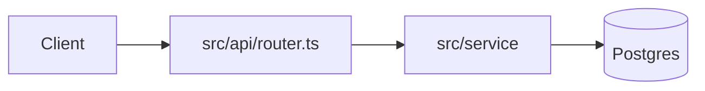

# Note Templates

**Load this reference when:** writing or rewriting a vault note.

Notes summarize. They never copy code beyond a signature, and never copy a
secret value (keys, tokens, passwords) from any file. Keep a file note under
about 40 lines — a reader should get the file's role in under a minute.

## File note — `files/<repo path>.md`

````markdown
---
source: src/api/router.ts
synced: 2026-10-01
tags: [file]
---
# router.ts

## Purpose
What this file is for, in one to three sentences.

## Key contents
- `createRouter(config)` — builds the HTTP router from the route table
- `ROUTES` — route table: path → handler

## Depends on
- [[files/src/lib/http.ts.md|http.ts]] — request helpers
- External: `express`

## History
- 2026-10-01 · implementer (Task 3) · claude-sonnet-5-5 — added retry with backoff
````

- `source:` is the repo-relative path; `synced:` is the date of the last edit.
- **Depends on** lists project files as links and external packages as plain
  text. Links always carry the explicit `.md`: `[[files/src/lib/http.ts]]`
  would point at the source file, not its note. Obsidian's backlinks pane
  shows the reverse direction, so there is no "Used by" list to maintain.
- **History** gets one line per change, newest last:
  `- <date> · <agent> · <model id> — <what changed>`.
- Config, data and documentation files take the same shape; Key contents
  lists the keys, sections or records that matter.

## Architecture note — `Architecture.md`

````markdown
---
tags: [architecture]
---
# <Project name> — Architecture

## Purpose
What the project does and for whom, in two or three sentences.

## Stack
Languages, frameworks, runtimes, build and test tools.

## Entry points
- [[files/src/main.ts.md|main.ts]] — process start: loads config, starts the server

## Modules
- **src/api/** — HTTP layer. Key files: [[files/src/api/router.ts.md|router.ts]]
- **src/lib/** — shared helpers. Key files: [[files/src/lib/http.ts.md|http.ts]]

## Data flow


## External services and configuration
- Postgres — connection string from `DATABASE_URL`

## Conventions
- Tests live next to sources as `*.test.ts`.
````

- **Modules** names every top-level source directory with its key file
  notes; the folder tree and the graph view cover the rest.
- Keep it under about 120 lines; link to file notes instead of repeating
  them.
